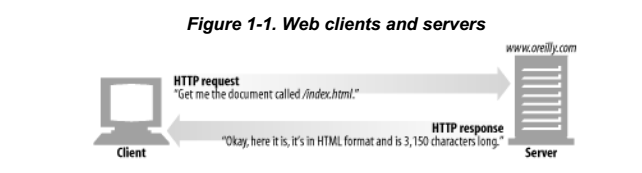
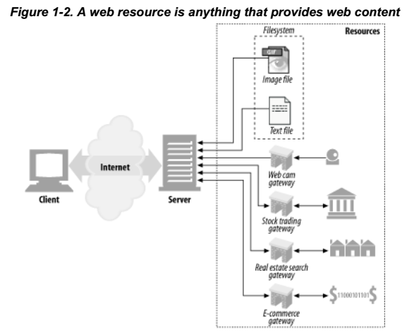
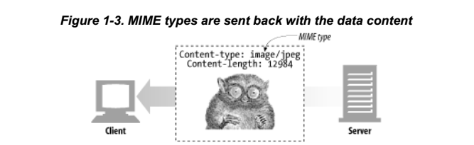
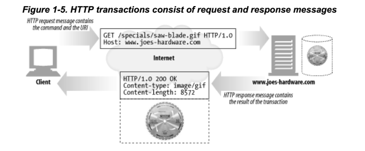
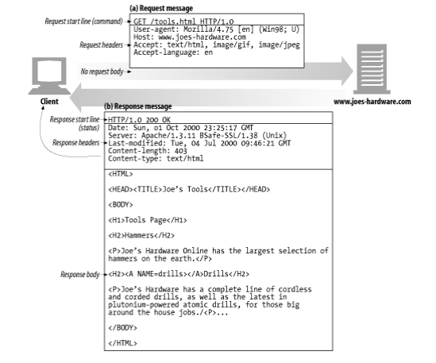

* 『HTTP 완벽가이드-웹은 어떻게 동작하는가』, 이응준, 정상일 옮김, 인사이트 도서에 대한 요약 정리 포스트입니다.
* O'Relly 사의 『HTTP:The Definitive Guide』를 원서로 하고 있습니다.

## Introduction

* 책은 크게 5 Part, 21개 chapter로 이루어져 있습니다.
* 본 포스트에서는 '1부. HTTP: 웹의 기초', '2부. HTTP: 아키텍처' 내용을 읽고 요약해서 정리해서 올리는데 1차적인 목적을 두겠습니다.
* 그외 챕터에 대한 내용은 추가 학습을 통해서 정리해보도록 하겠습니다.

* **1부구성**
	- 1장 : HTTP에 대한 개괄적 설명
	- 2장 : URL과 리소스에 대한 설명
	- 3장 : HTTP 메시지가 어떻게 Web 컨텐츠를 전송하는지 설명
	- 4장 : HTTP 커넥션 관리에 대한 설명

* **2부구성**
	- HTTP 서버, Proxy, Cache, Gateway, Robot Application과 같은 웹 시스템을 구성하는 빌딩 블록을 다룸
	- 5장 : 웹 서버 아키텍처에 대한 내용
	- 6장 : Proxy 서버에 대한 학습
	- 7장 : 캐싱- 웹 캐시가 동작하는 방식 학습
	- 8장 : 게이트웨이와 애플리케이션 서버에 대해 학습
	- 9장 : 웹 로봇, 스파이더, 검색엔진 등-> 웹 전반에 쓰이는 다양한 클라이언트
	- 10장 : HTTP/2.0 프로토콜 소개

## 1부 HTTP : 웹의 기초

### 1장 HTTP 개관

* 웹 클라이언트 / 리소스
	- 웹 콘텐츠는 Web 서버에 존재하며 클라이언트는 서버에 HTTP 요청을 보내고 서버는 요청된 데이터를 HTTP 응답으로 돌려준다.
	- 웹 서버는 리소스를 관리하고 클라이언트에 제공하는 역할을 수행한다.
	- > 리소스(Resource) : 리소스의 범위는 일반적이고 방대함. HTTP 서비스 개념에서는 **어떠한 종류의 컨텐츠**도 리소스가 될 수 있음. 예를 들어 스프레드시트, 이미지, 웹 게이트웨이, 검색엔진 등등이 리소스 범주에 든다. 
 
---

* 미디어타입(MIME : Multipurpose Internet Mail Extensions, 다목적 인터넷 메일 확장)
	- 인터넷은 수많은 데이터 타입을 다루기 때문에 HTTP는 웹에서 전송되는 객체에 각각에  MIME 타입이라는 데이터 포맷 라벨을 붙인다.
	- 웹 브라우저는 서버로 부터 객체를 돌려받을 때, 다룰수 있는 객체인지 MIME 타입을 통해서 확인한다.
	- > MIME 타입 : MIME 타입은 사선(/)로 구분된 주 타입(primary object type)과 부타입(specific subtype)으로 이루어진 문자열 라벨이다. 예를들어 HTML로 작성된 텍스트 문서는 'text/html' 라벨이 붇고 JPEG 이미지는 'image/jpeg'가 붙는다.

* URI(통합 자원 식별자 : Uniform Resource Identifier)
	- URI는 인터넷의 **우편물 주소**와 같은 개념으로 정보 리소스를 고유하게 식별하고 위치를 지정하는 역할
	- URL(통합 자원 지시자 Uniform Resource Locator)는 리소스 식별자의 가장 흔한 형태로, 한 리소스에 대한 구체적 위치를 서술한다.
	- | URL | 설명 |
|--------|--------|
| http://www.oreilly/index.html  |  오라일리 출판사의 URL |
|http://host/inventory-check.cgi?item=12731|물품 #12731의 재고가 있는지 확인하는 프로그램에 대한 URL|

	- 대부분의 URL은 세부분으로 이루어진 표준 포맷을 따른다.
		* URL의 첫번째 부분은 스킴(Scheme)으로 불리며, 리소스에 접근하기 위한 프로토콜을 서술한다(E.g. 'http://')
		* 두 번째 부분은 서버의 인터넷 주소(E.g. 'www.humanitas03.com')
		* 마지막은 웹 서버의 리소스를 가리킨다(E.g. '/specials/item01.gif)
	- 오늘날 대부분의 URI는 URL로 본다.(특별한 언급이 없으면 통상적인 관례에 따라 URI와 URL을 같은 의미로 본다)

___

* 트랜잭션(Transaction)
	- 클라이언트가 웹 서버와 리소스를 주고받기 위해 HTTP를 사용하기 위해서는 **HTTP 트랜잭션**에 대한 이해가 필요하다.
	- HTTP 트랜잭션은 요청명령(클라이언트에서 서버로 보내는)과 응답 결과(서버가 클라이언트에게 돌려주는)로 구성되어 있다.

* 메서드
	- 모든 HTTP 요청 메시지는 한 개의 메서드를 갖습니다.
	- 메서드는 서버에 어떤 동작이 취해져야 되는지 알려줍니다

| HTTP 메서드   |    설명      |
|--------------|:-------------|
| GET          |  서버에서 클라이언트로 지정한 리소스를 보낸다 |
| PUT          |  클라이언트에서 서버로 보낸 데이터를 지정한 이름의 리소스로 저장 |
| DELETE | 지정한 리소스를 서버에서 삭제 |
|POST|클라이언트 데이터를 서버 게이트웨이 애플리케이션으로 보낸다|
|HEAD|지정한 리소스에 대한 응답에서, HTTP헤더 부분만 보낸다|
{: .table .table-striped .table-hover}

* 메시지
	- 요청 메시지 : 웹 클라이언트에서 웹 서버로 보낸 HTTP 메시지
	- 응답 메시지 : 웹 서버에서 클라이언트로 가는 메시지
	- HTTP 메시지는 3가지로 나뉘어 집니다
		* 시작줄 : 'HTTP/1.0 200 OK'
		* 헤더 : 
'Content-type: text/plain'
'Content-length: 19'
		* 본문 : 'Hi! I'm a message!'
		* (EX. GET 트랜잭션의 예)

* TCP(Transmission Control Protocol)
	- >**TCP/IP**
TCP/IP는 TCP와 IP가 층을 이루는, 패킷 교환 네트워크 프로토콜의 집합입니다.
TCP/IP 프로토콜은 다음을 제공합니다.
		* 오류없는 데이터 전송
		* 순서에 맞는 전달(데이터는 언제나 순서대로)
		* 조각나지 않는 데이터 스트림

	- TCP/IP는 각 네트워크와 하드웨어 특성을 숨기고 어떤 종류의 컴퓨터나 네트워크든 서로 신뢰성 있는 의사소통을 하게 해주는 역할을 합니다.
	- TCP/IP를 이용한 HTML 리소스 통신
		1) 웹 브라우저는 서버의 URL에서 호스트 명을 추출합니다
        2) 웹브라우저는 서버의 호스트명을 IP로 변환합니다.
        3) 웹 브라우저는 URL에서 포트번호(기본 80, 있다면)를 추출한다.
        4)웹 브라우저는 웹 서버와 TCP 커넥션을 맺는다
        5) 웹 브라우저는 서버에 HTTP 요청을 보낸다.
        6) 서버는 웹 브라우저의 HTTP 응답을 돌려준다
        7) 커넥션이 닫히면 웹브라우저는 문서를 보여준다.

* HTTP 프로토콜 버전
	- HTTP/1.0
		* 처음으로 널리 쓰이게된 HTTP버전
		* HTTP 헤더, 추가메서드, 멀티미디어 객체 처리를 추가
		* 웹페이지와 상호작용하는 폼 실현
    * HTTP/1.1
    	* HTTP 설계의 구조적 결함 교정, 두드러진 성능 최적화, 잘못된 기능 제거에 집중
    	* 현재의 HTTP 버전
    * HTTP/2.0
    	* HTTP/1.1 성능 문제를 개선하기 위해 구글의 SPDY 프로토콜을 기반으로 설계가 진행중인 프로토콜

* 웹의 구성요소 소개
	- 프락시 : 클라이언트와 서버사이에 위치한 HTTP 중재자
	- 캐시 : 많이 찾는 웹페이지를 클라이언트 가까이 보관하는 HTTP창고
	- 게이트웨이 : 다른 애플리케이션과 연결된 특별한 웹 서버
	- 터널 : 단순히 HTTP통신을 전달하기만 하는 특별한 프락시
	- 에이전트 : 자동화된 HTTP 요청을 만드는 준지능적 웹클라이언트

