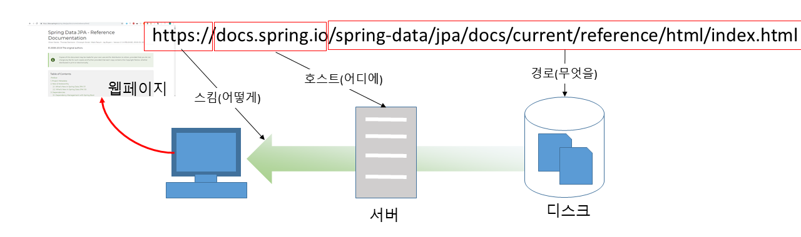
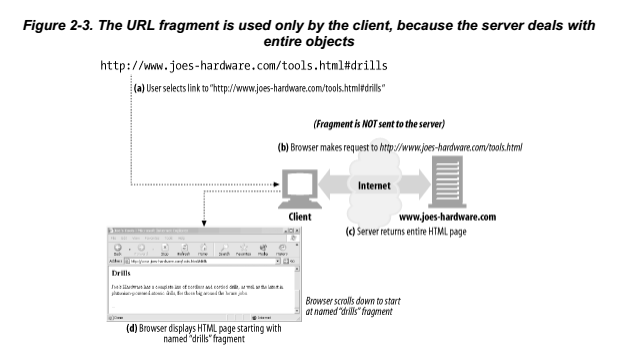

* 『HTTP 완벽가이드-웹은 어떻게 동작하는가』, 이응준, 정상일 옮김, 인사이트 도서에 대한 요약 정리 포스트입니다.
* O'Relly 사의 『HTTP:The Definitive Guide』를 원서로 하고 있습니다.

### 1부 HTTP : 웹의 기초

#### 2장 URL과 리소스

* URL 개요
	- URL을 사용하면 하나의 인터페이스를 통해 일관된 방식으로 많은 리소스에 접근이 가능
	- Ex) ftp://ftp.humanitas03.com/pub/file.png


* URL 문법
	- 대부분의 URL 스킴의 문법은 일반적으로 9개 부분으로 나뉨
	- ```
	<스킴>://<사용자이름>:<비밀번호>@<호스트>:<포트>/<경로>;<파라미터>?<질의>#<프래그먼트>
		```


* 스킴
	- 스킴은 주어진 리소스에 어떻게 접근하는지 알려주는 정보
	- URL을 해석하는 어플리케이션이 어떤 프로토콜을 사용하여 리소스를 요청하는지 알려줍니다.

* 호스트와 포트
	- 애플리케이션이 인터넷에 있는 리소스를 찾으려면, 리소스를 호스팅하고 있는 장비와 그 장비 내애서 리소스에 접근할 수 있는 서버가 어디에 있는지 알아야 합니다.
	- 호스트 컴포넌트는 접근하려고 하는 리소스를 가진 인터넷상의 호스트 장비를 가리킵니다.
	- 포트 컴포넌트는 서버가 열어놓은 네트워크 포트를 가리키며 내부적으로 TCP 프로토콜을 사용하는 HTTP를 기본 포트로 80을 사용합니다.

* 경로
	- 계층적 파일 시스템 구조와 유사한 형태로 리소스가 서버 어디에 위치해있는지 알려주는 컴포넌트

* 파라미터
	- 애플리케이션의 서버에 정확한 요청을 하기 위해 필요한 입력 파라미터를 받는데 사용합니다.

* 질의 문자열
	- URL의 질의 컴포넌트는 게이트웨이를 가리키는 URL의 경로를 컴포넌트와 함께 전달합니다.
	- 보통 게이트웨이는 다른 애플리케이션에 접근하려고 할때 거치는 통로입니다.
	- 특정 문자열을 제외하고 질의 컴포넌트의 포맷 제약 사항은 없습니다.
	- 편의상 만은 게이트웨이가 '&'로 나뉜 '이름=값' 쌍 형식으로 문자열을 원합니다.

* 프래그먼트
	- 리소스의 특정 부분을 가리킬 수 있도록, URL은 리소스 내의 조각을 가리킬 수 있는 프래그먼트 컴포넌트를 제공합니다.
	- 일반적으로 HTTP 서버는 객체 일부가 아닌 전체를 다루기 때문에, 클라이언트는 서버에 프래그먼트를 전달하지 않습니다.
	- 브라우저가 서버로부터 전체 리소스를 내려받은 후, 프래그먼트를 사용하여 유저가 보고자 하는 리소스의 일부를 보여줍니다.
	


#### 추가학습

* HTTP / HTTPS

| 스킴 | 설멍 |
|--------|:--------|
|http     |사용자 이름이나 비밀번호가 없다는 것을 제외하고는, 일반 URL 포맷을 지키는 하이퍼 텍스트를 전송프로토콜(Hypertext Transfer Protocol)스킴이다. 포트값이 생략되어 있으면 기본 값은 80이다.|
|https|https 스킴은 http 스킴과 거의 같다. 다른 점이라고는 https는 HTTP의 커넥션의 양 끝단에서 암호화하기 위해 넷스케이프에서 개발한 보안 소켓 계층(Secure Sockets Layer, SSL)을 사용한다는 것 뿐이다. 문법은 HTTP와 같고 기본 포트값은 443이다.|
{: .table .table-striped .table-hover}


* URL 인코딩 체계
	- 안전한 문자 집합을 이용하는 경우 그 표현의 한계를 넘기 위해, URL에 있는 안전하지 않은 문자들을 표현하기 위한 인코딩 방식이 고안되었다.
	- 안전하지 않은 문자를 퍼센티지(%) 기호로 시작해, ASCII 코드로 표현되는 두 개의 16진수 숫자로 이루어진 '이스케이프' 문자로 바꾼다.
	- 비 라틴계 언어(==ASCII에서 지원하지 않은 문자열)지원을 위해 URL에 이스케이프 문자열을 쓸수 있게 설계되었습니다.
	- 한글이 URL에 표현되면 '%'가 포함된 문자들이 나열되는 것이 이와 같은 맥락으로 볼 수 있습니다.

| 문자 | ASCII코드 |URL의 예|
|--------|:--------|:---------|
|~|126(0x7E)|http://www.humanitas03.com/%7Ehum|
|빈 문자|32(0x20)|http://www.humanitas03.com/more%20tools.html|
|% |37(0x25)|http://www.humanitas03.com/100%25satistifaction.html|
{: .table .table-striped .table-hover}


