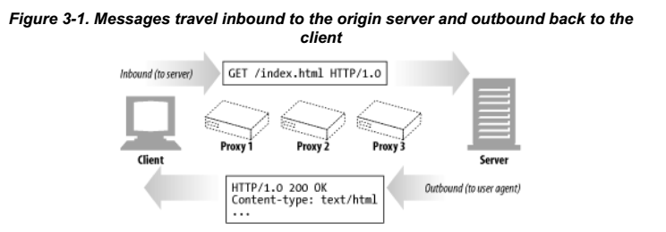
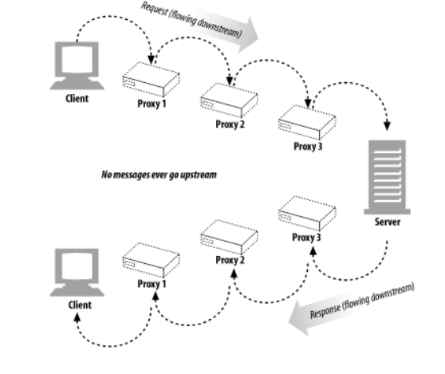
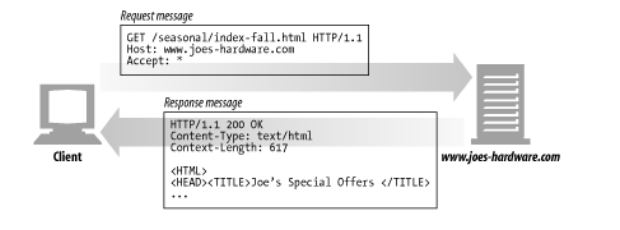
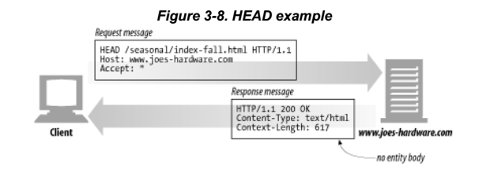
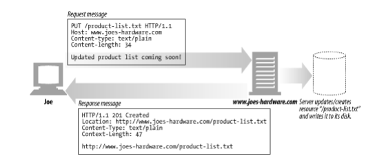
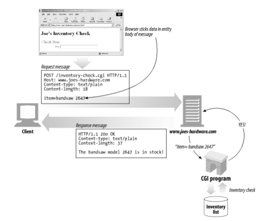
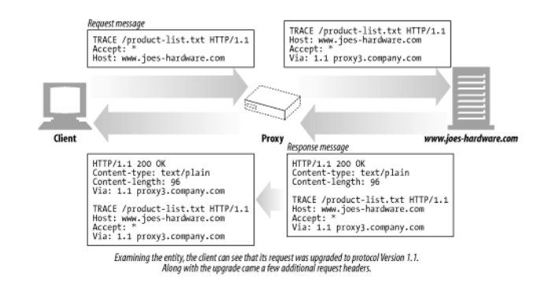
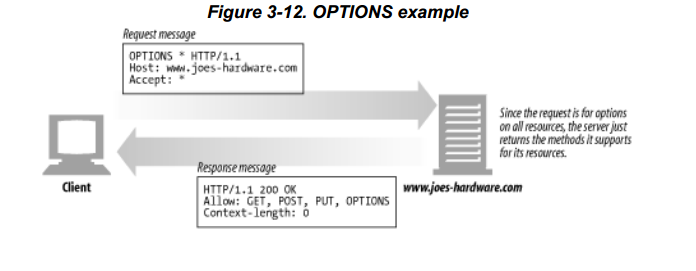
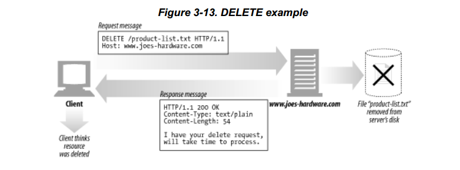
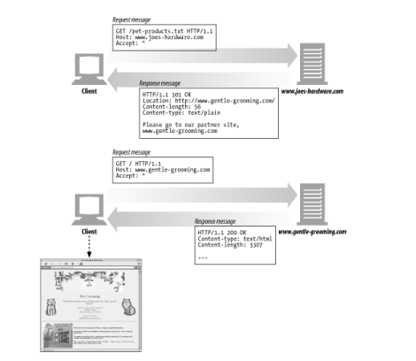

* 『HTTP 완벽가이드-웹은 어떻게 동작하는가』, 이응준, 정상일 옮김, 인사이트 도서에 대한 요약 정리 포스트입니다.
* O'Relly 사의 『HTTP:The Definitive Guide』를 원서로 하고 있습니다.


### 1부 HTTP : 웹의 기초


#### 3장 메세지

* 메시지의 흐름
	- HTTP 메시지는 내용과 의미를 설명하는 텍스트 **메타정보**로 시작하고 그 다음에 선택적으로 데이터가 올 수 있다.
	- 이 메시지는 클라이언트, 서버, 프락시 사이를 흐른다.

* 인바운드/아웃바운드
	- HTTP는 인바운드와 아웃바운드라는 용어를 트랜잭션 방향을 표현하기 위해 사용된다.
	- 인바운드 : 메시지가 원 서버로 향하는것
	- 아웃바운드 : 모든 처리가 끝난뒤에 사용자 에이전트로 돌아오는 것


* 다운스트림/업스트림
	- 모든 메시지는 다운스트림으로 흐른다.
	- 그림에서 프락시1이 프락시 3의 업스트림이지만 응담 메시지에서는 프락시 3이 다운스트림으로 칭한다
	- > 업스트림이나 다운스트림은 발송자와 수신자에 대한 것이다. 메시지가 원 서버를 향하는가 아니면 클라이언트를 향하는 가가 문제가 아니다.




* HTTP 메시지
HTTP 메시지는 단순한, 데이터의 구조화된 블록입니다.
메시지는 **시작줄, 헤더블록, 본문** 세 부분으로 나누어 집니다.

```
> 요청메시지 형식
	<메서드><요청URL><버전>
    <헤더>
    <엔티티본문(body)>
    EX) GET /special/saw-blade.gif HTTP/1.0
    	HOST: ...
```


```
> 응답메시지 형식
	<버전><상태코드><사유구절>
    <헤더>
    <엔터티본문>
    EX) HTTP/1.0 200 OK
    	Content-Type: image/gif
        Content-Length:8572
```

* 메서드
	- 클라이언트 측에서 서버가 리소스에 대해 수정해주길 바라는 동작

* 요청 URL
	- 요청 대상이 되는 리소스를 지칭하는 완전한 URL 또는 URL의 구성요소

* 버전
	- 메시지에서 사용중인 HTTP 버전

* 상태코드
	- 요청중에 무엇이 일어났는지 설명하는 세자리 숫자

* 사유구절
	- 숫자로 된 상태코드의 의미를 사람이 이해할수 있게 설명해주는 짧은 문구

* 엔티티 본문(body)
	- 임의의 데이터 블록
	- 모든 메시지가 본문(body)를 반드시 가지는 것은 아니므로, 때때로 메시지는 그냥 CRLF로 끝나게 된다.


##### 시작줄

요청메시지의 시작줄은 무엇을 해야하는지 말해준다

* 요청줄
	- 요청줄에는 서버에서 어떤 동작이 일어났는지 설명하는 **메서드**와 그 동작에 대한 대상을 지칭하는 **요청 URL**이 들어있다.
	- 요청줄은 클라이언트가 어떤 HTTP버전으로 말하는지 서버에 알려주는 HTTP 버전도 포함된다.
	- 모든 필드는 공백으로 구분된다.

* 응답줄
	- 응답 메시지는 수행결과에 대한 상태정보와 결과 데이터를 클라이언트에게 돌려준다.
	- 시작줄 혹은 응답줄에는 응답 메시지에 쓰인 HTTP버전, 숫자로된 상태코드, 수행항태에 대해 설명해주는 텍스트로 된 사유구절이 존재한다.

* 메서드
	- 요충절의 시작줄은 메서드로 시작하며, 서버에게 무엇을 해야하는지 말해준다.
	- Ex) 'GET /specials/saw-blade.gif HTTP/1.0' 이라는 줄에서 메서드는 GET 메서드
	- 아래의 표에서는 7가지 메서드에 대해 서술하며, 메서드에 따라 요청 메시지에 본문이 있는 경우도 있고 없는 경우도 있음
	- HTTP는 쉽게 확장 할 수 있도록 설계되었기 때문에, 다른 서버는 그들만의 메서드를 추가로 구현했을 수도 있다. 이러한 추가 메서드는 HTTP명세를 확장한 것이기 때문에 ***확장 메서드*** 라고 불린다.

| 메서드 | 설멍 |메시지 본문 여부|
|--------|:--------|-------|
|GET|서버에서 어떤 문서를 가져온다|없음|
|HEAD|서버에서 어던 문서에 대해 헤더만 가져온다.|없음|
|POST|서버가 처리해야할 데이터를 보낸다.|있음|
|PUT|서버에 요청메시지의 본문을 저장한다.|있음|
|TRACE|메시지가 프락시를 거쳐 서버에 도달하는 과정을 추적한다.|없음|
|OPTIONS|서버가 어떤 메서드를 수행할 수 있는지 확인한다.|없음|
|DELETE|서버에서 문서를 제거한다|없음|
{: .table .table-striped .table-hover}

* 상태코드
	- 클라이언트에게 무엇이 일어났는지 말해주는 상태코드
	- 상태코드는 각 응답 메시지의 시작줄에 담겨 반환된다.
	- 숫자로된 코드와 문자로된 메시지 두가지 형태 모두 포함이 된다.

| 전체범위 | 정의된 범위 |분류|
|--------|:--------|-------|
|100~199|100-101|정보|
|200~299|200-206|성공|
|300~399|300-305|리다이렉션|
|400~499|400-415|클라이언트 에러|
|500~599|500-505|서버 에러|
{: .table .table-striped .table-hover}

* 버전번호
	- 요청과 응답 메시지 양쪽에서 기술한다.
	- 버전 번호는 어떤 애플리케이션에서 지원하는 가장 높은 HTTP버전을 가리킨다.


##### 헤더

* 헤더 분류
	- 일반 헤더 : 요청과 응답 양쪽에 모두 나타날 수 있음
	- 요청 헤더 : 요청에 대한 부가정보 제공
	- 응답 헤더 : 응답에 대한 부가정보를 제공
	- Entity 헤더 : 본문의 크기와 콘텐츠, 혹은 리소스 그 자체를 서술
	- 확장 헤더 : 명세에 정의 되지 않은 새로운 헤더


#### 메서드

##### 안전한 메서드(Safe Method)
GET과 HEAD메서드는 안전하다고 할 수 있는데, 이는 GET이나 HEAD 메서드를 사용하는 HTTP의 결과로 서버에 어떤 작용도 없음을 의미한다.
안전한 메서드의 목적은, 서버에 어떤 영향을 줄 수 있는 안전하지 않은 메서드가 사용될 때 사용자들에게 그 사실을 알려주는 HTTP 애플리케이션을 만드는 것에 있다.

##### GET

GET은 가장 흔히 쓰이는 메시지이다. 주로 서버에게 리소스를 달라고 요청하기 위해 쓰인다.


##### HEAD
HEAD 메서드는 GET처럼 행동하지만, 서버는 응답으로 헤더만 돌려준다.(엔티티 본문은 반환하지 않는다.)



##### PUT
GET메서드가 서버로부터 문서를 읽어들이는데 반해, PUT메서드는 서버에서 문서를 쓴다.
서버가 요청의 본문을 가지고 요청 URL의 이름대로 새 문서를 만들거나, 이미 URL이 존재한다면 본문을 사용해서 교체하는 것이다.



##### POST
POST 메서드는 서버에 입력 데이터를 전송하기 위해 설계되었다.
채워진 폼에 담긴 데이터는 서버로 전송되며, 서버는 이를 모아서 필요로 하는 곳(그 데이터를 처리할 서버 게이트웨이 프로그램)에 보낸다.



##### TRACE
클라이언트에게 자신의 요청이 서버에 도달했을 때 어떻게 보이게 되는지 알려준다.

* TRACE 요청은 목적지 서버에서 '루프백(loopback)' 진단을 시작한다.
* TRACE 메서드는 주로 진단을 위해 사용된다. 예를 들면 요청의 의도한 요청/응답 연쇄를 거쳐가는지 검사할 수 있다. 또한 프락시나 다른 애플리케이션들이 요총에 어떤 영향을 미치는지 확인해보고자 할 때 좋은 도구이다.
* TRACE는 진단을 위해 사용하기 괜찮지만... 어떻게 TRACE는 메서드를 구별하는 메커니즘을 제공하지 않는다.
* TRACE 요청은 어떠한 엔터티 본문도 보낼 수 없다. TRACE 응답의 엔터티 본문에는 서버가 받은 요청이 그대로 들어 있다.



##### OPTIONS
웹 서버에게 여러가지 종류의 지원 범위에 대해서 물어본다.
서버에게 특정 리소스에 대해 어떤 메서드가 지원되는지 물어 볼 수 있다.



##### DELETE
DELETE 메서드는 서버에게 요청 URL로 지정한 리소스를 삭제할 것을 요청한다.

* HTTP 명세는 서버가 클라이언트에게 알리지 않고 요청을 무시하는 것을 허용하기 때문에 클라이언트는 삭제가 수행되는 것을 보장하지 못한다.




##### 확장 메서드

* 확장멧드는 HTTP/1.1 명세에 정의되지 않은 메서드다.
* 개발자들에게 그들의 서버가 구현한 HTTP 서비스의 서버가 관리하는 리소스에 대한 능력을 확장하는 수단을 제공
___

#### 상태코드

##### 1. 100-199: 정보성 상태코드

정보성 상태코드는 HTTP/1.1에서 도입되었음.

| 상태코드 |사유구절 |의미|
|--------|:--------|-------|
|100|Continue|요청의 시작부분일부가 받아들여졌으며, 클라이언트는 나머지를 계속 이어서 보내야함을 의미|
|101|Switching Protocols|클라이언트가 Upgrade 헤더에 나열한 것 중 하나로 서버가 프로토콜을 바꾸었음을 의미|
{: .table .table-striped .table-hover}

##### 2. 200-299 : 성공상태코드

서버는 대응하는 성공을 의미하는 상태코드의 배열을 갖고 있으며, 각각 다른 종류의 요청에 대응한다.

| 상태코드 |사유구절 |의미|
|--------|:--------|-------|
|200|OK|요청은 정상이고, 엔터티 본문은 요청된 리소스를 포함하고 있다.|
|201|Created|서버 개체를 생성하라는 요청(Ex. PUT)을 위한 것. 응답은, 생성된 리소스에 대한 최대한 구체적인 참조가 담긴 Location헤더와 함께, 그 리소스를 참조할 수 있는 여러 URL을 엔터티 본문에 포함해야 한다.서버는 상태코드를 보내기에 앞서 반드시 객체를 생성해야 한다.|
|202|Accept|요청은 받아들여 졌으나 서버는 아직 그에 대한 어떤 동작도 수행하지 않았다. 서버가 요청의 처리를 완료할 것인지에 대한 어떤 보장도 없다. 이것은 단지 요청이 받아들이기에 적법해 보인다는 의미일 뿐이다.|
|203|Non-Authoritative Information|엔터티 헤더에 들어있는 정보가 원래 서버가 아닌 리소스의 사본에서 왔다. 중개자가 리소스의 사본을 갖고 있었지만, 리소스에 대한 메타 정보(헤더)를 검증하지 못한 경우 이런 일이 발생할 수 있다.이 응답 코드는 필수적으로 사용되어야 하는 것은 아니다. 이것은 엔터티 헤더가 원래 서버에서 온 것이였다면 응답이 200상태였을 애플리케이션을 위한 선택사항이다.|
|204|No Content|응답 메시지는 헤더와 상태줄을 포함하지만 엔터티 본문은 포함하지 않는다.주로 웹브라우저를 새 문서로 이동시키지 않고 갱신하고자 할때(폼을 리프레시 할때)사용한다.|
|205|Reset Content|주로 브라우저를 위해 사용되는 또 하나의 코드, 브라우저에게 현재 페이지에 있는 HTML폼에 채워진 모든 값을 비우라고 말한다.|
|206|Partial Content|부분 혹은 범위 요청이 성공했다.|
{: .table .table-striped .table-hover}

##### 3. 300-399 리다이렉션 상태 코드

리다이레견 상태코드는 클라이언트가 관심있어 하는 리소스에 대해 다른 위치를 사용하라고 말해주거나 그 리소스의 내용 대신에 다른 대안 응답을 제공합니다.

리다이렉션 상태 코드의 몇몇은 리소스에 대한 어플리케이션의 로컬 복사본이 원래 서버와 비교했을 때 유효한지 확인하기 위해 사용됩니다.



| 상태코드 |사유구절 |의미|
|--------|:--------|-------|
|300|Multiple Choices|클라이언트가 동시에 여러 리소스를 가리키는 URL을 요청한 경우, 그 리소스의 목록과 함께 반환. 사용자는 목록에서 원하는 하나를 선택 가능. 어떤 서버가 하나의 HTML문서를 영어와 한국어 모두로 제공하는 경우 사용가능|
|301|Moved Permanently|요청한 URL이 옮겨졌을 때 사용한다. 응담은 Location 헤더에 현재 리소스가 존재하고 있는 URL을 포함해야 한다.|
|302|Found|301코드와 같다. 그러나 클라이언트는 Location헤더로 주어진 URL을 리소스를 임시로 가리키기 위한 목적으로 사용해야 한다. 이후의 요청에서는 원래 URL을 사용해야 한다.|
|303|See Other|클라이언트에게 리소스를 다른 URL에서 가져와야 한다고 말해주고자 할 때 쓰인다. 새 URL은 응답메시지의 Location헤더에 들어있다. 이 상태코드의 주 목적은 POST 요청에 대한 응답으로 클라이언트에게 요청 위치를 알려주는 것|
|304|Not Modified|클라이어트는 헤더를 이용해 조건부 요청을 만들 수 있다. 만약 클라이언트가 GET과 같은 조건부 요청을 보냈고 그 요청한 리소스가 최근에 수정된 일이 없다면, 이 코드는 리소스가 수정되지 않았음을 의미하게된다. 이 상태코드를 동반한 응답은 엔터티 본문을 가져서는 안된다.|
|305|Use Proxy|리소스가 반드시 프락시를 통해서 접근되어야 함을 나타내기 위해 사용한다. 프락시의 위치는 Location 헤더를 통해 주어진다. 클라이언트는 이 응답을 특정 리소스에 대한 것이라고만 해석한다.|
|306|(사용되지 않음)|현재는 사용되지 않음|
|307|Temporary Redirect|301 상태 코드와 비슷하다. 그러나 클라이언트는 Location 헤더로 주어진 URL을 리소스를 임시로 가리키기 위한 목적으로 사용해야 한다. 이후의 요청에서 원래 URL을 사용한다.|
{: .table .table-striped .table-hover}

##### 4. 400-499 클라이언트 에러 상태 코드

가끔 클라이언트는 서버가 다룰 수 없는 무엇인가를 보낸다. 잘못 구성된 요청메시지, 존재 하지 않는 URL에 대한 요청 등에 대한 상태 코드를 의미한다.

| 상태코드 |사유구절 |의미|
|--------|:--------|-------|
|400|Bad Request|클라이언트가 잘못된 요청을 보냈다고 말해준다.|
|401|Unauthorize|리소스를 얻기 전에 클라이언트에게 스스로를 인증하라고 요구하는 내용의 응답을 적절한 헤더와 함께 반환한다.|
|402|Payment Required|현재 이 상태코드는 쓰이지 않지만, 미래에 쓰일 가능성이 있어 준비해둠|
|403|Forbidden|요청이 서버에 의해 거부되었음을 알려주기 위해 사용한다. 만약 서버가 왜 요청이 거부되었는지 알려주고자 한다면, 서버는 그 이유를 설명하는 엔터티 본문을 포함시킬 수 있다. 보통 서버의 거절 이유를 숨기고 싶을때 이 코드를 사용한다.|
|404|Not Found|서버가 요청한 URL을 찾을 수 없음을 알려주기 위해 사용한다.|
|405|Method Not Allowed|요청한 URL에 대해, 지원하지 않는 메서드로 요청받았을 때 사용한다. 요청한 리소스에 대해 어떤 메서드가 사용가능한지 클라이언트에게 알려주기 위해, 요청에 Allow헤더가 포함되어야 한다.|
|406|Not Acceptable|클라이언트는 자신이 어던 종류의 엔터티를 받아들이고자 하는지에 대해 매개변수로 명시할 수 있다. 이 코드는 URL에 대한 리소스 중 클라이언트가 받아들일 수 있는 것이 없는 경우 사용한다.|
|407|Proxy Authentication Required|401 상태코드와 같으나, 리소스에 대해 인증을 요구하는 프락시 서버를 위해 사용|
|408|Request Timeout|클라이언트의 요청을 완수하기에 시간이 너무 많이 걸리는 경우 서버는 이 상태코드로 응답하고 연결을 끊을 수 있다. 이 타임아웃의 길이는 서버마다 다르지만 대개 어떠한 적법한 요청도 받아들일 수 있을 정도로 충분히 길다.|
|409|Conflict|요청이 리소스에 대해 일으킬 수 있는 몇몇 충돌을 지칭하기 위해 사용한다. 서버는 요청이 충돌을 일으킬 염려가 있다고 생각될 때 이 요청을 보낼 수 있다.|
|410|Gone|404와 비슷하나, 서버가 한 때 그 리소스를 갖고 있었다는 점이 다르다. 주로 웹 사이트를 유지보수하면서, 서버 관리자가 클라이언트에게 리소스가 제거된 경우 이를 알려주기 위해 사용한다.|
|411ㅣLength Required|서버가 요청 메시지에 Content-Length 헤더가 있을 경우 요구할 때 사용한다.|
|412|Precondition Failed|클라이언트가 조건부 요청을 했는데 그 중 하나가 실패했을 때 사용한다.|
|413|Request Entity Too Large|서버가 처리할 수 있는 혹은 처리하고자 하는 한계를 넘은 크기의 요청을 클라이언트가 보냈을 때 사용한다.|
|414|Request URI Too Long|서버가 처리할 수 있는 혹은 처리하고자 하는 한계를 넘은 크기의 URL이 포함된 요청을 클라이언트가 보냈을 때 사용|
|415|Unsupported Media Type|서버가 이해하거나 지원하지 못하는 내용 유형의 엔터티를 클라이언트가 보냈을 때 사요한다.|
|416|Requested Range Not Satisfiable|요청 메시지가 리소스의 특정 범위를 요청했는데, 그 범위가 잘못되거나 맞지 않을 때 사용|
|417|Expectation Failed|요청에 포함된 Expect 요청 헤더에 서버가 만족시킬 수 없는 기대가 담겨있는 경우 사용|
{: .table .table-striped .table-hover}

##### 5. 500-599 서버 에러상태 코드

때때로 클라이언트가 올바른 요청을 보냈음에도 서버 자체에서 에러가 발생하는 경우가 있다.


| 상태코드 |사유구절 |의미|
|--------|:--------|-------|
|500|Internal Server Error|서버가 요청을 처리할 수 없게 만드는 에러를 만났을 때 사용한다.|
|501|Not Implemented|클라이언트가 서버의 능력을 넘은 요청을 햇을 때 사용한다.(ex. 서버가 지원하지 않는 메서드를 사용)|
|502|Bad Gateway|프락시나 게이트웨이처럼 행동하는 서버가 그 요청 응답 연쇄에 있는 다음 링크로부터 가짜 응답에 맞닥뜨렸을때 사용한다.(ex. 만약 자신의 부모 게이트웨이에 접속하는 것이 불가능할 때)|
|503|Service Unavailable|현재는 서버가 요청을 처리해 줄 수 없지만 나중에는 가능함을 의마하고자 할때 사용한다.|
|504|Gateway Timeout|상태코드 408과 비슷하지만, 다른 서버에게 요청을 보내고 응답을 기다리다 타임아웃이 발생한 게이트웨이나 프락시에서 온 응답이라는 점에서 다르다.|
|505|Http Version Not Supported|서버가 지원할 수 없거나 지원하지 않으려고 하는 버젼의 프로토콜로 된 요청을 받았을 때 사용한다.|
{: .table .table-striped .table-hover}


#### 헤더

헤더와 메서드는 클라이언트와 서버가 무엇을 하는지 결정하기 위해 사용한다.

헤더에는 특정 종류의 메시지만 사용할 수 있는 헤더와, 더 일반 목적으로 사용할 수 있는 헤더, 그리고 응답과 요청 메시지 양쪽 모두에서 정보를 제공하는 헤더가 있다.

* 일반헤더(General Headers)
	- 일반 헤더는 클라이언트와 서버 양쪽 모두 사용한다.
	- 애플리케이션들을 위해 다양한 목적으로 활용
	- Ex) Date : Tue, 3 Oct 1974 02:16:00 GMT

* 요청헤더(Request Headers)
	- 요청 메시지를 위한 헤더
	- 서버에게 클라이언트가 받고자 하는 데이터 타입이 무엇인지와 같은 부가정보
	- 예를들어 Accept헤더는 서버에게 클라이언트가 자신의 요청에 대응하는 미디어 타입 데이터를 의미
	- Ex) Accept : \*/\*
* 응답헤더(Response Headers)
	-  클라이언트에게 정보를 제공하기 위한 자신만의 헤더를 가지고 있다.
	-  ex) Server : Tiki-Hut/1.0

* 엔티티헤더(Entity Headers)
	- 엔터티 본문에 대한 헤더
	- Ex) Content-Type : text/html; charset=iso-latin-1

* 확장헤더(Extension Headers)
	- 확장헤더는 애플리케이션 개발자들에 의해 만들어졌지만 아직 승인된 HTTP명세에는 추가되지 않은 비표준 헤더이다.


#### 더 알아보기

http://www.w3.org/Protocols/rfc2616/rfc2616.txt

HTTP Pocket Reference
Clinton Wong, O'Relly & Associates, Inc.

http://www.w3.org/Protocols/





